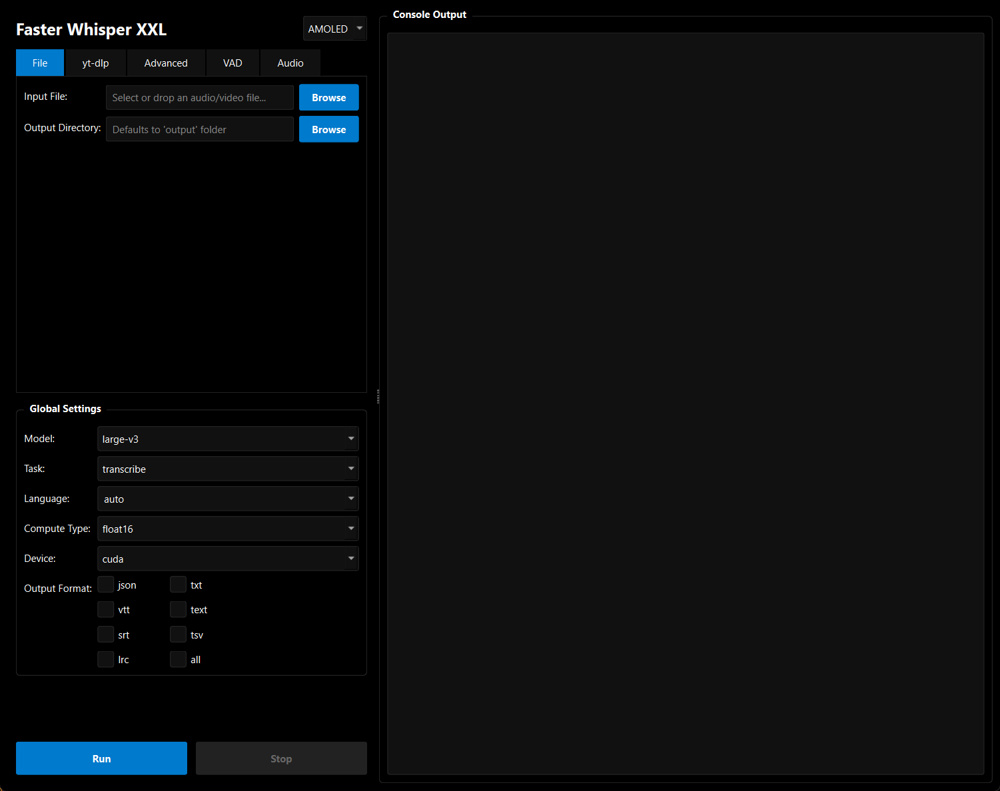

# Faster Whisper XXL GUI



## About

Faster Whisper XXL GUI is a user-friendly graphical interface for the powerful Faster Whisper XXL transcription engine. It simplifies the process of transcribing audio and video files, including direct YouTube video transcription, with a wide range of configurable options.

## Features

*   **Intuitive Interface:** Easy-to-use GUI for all transcription tasks.
*   **File Transcription:** Transcribe local audio and video files.
*   **YouTube Integration:** Directly download and transcribe YouTube videos (audio-only or full video).
*   **Automatic Dependency Setup:** Handles the download and setup of Faster Whisper XXL and FFmpeg.
*   **Customizable Settings:** Fine-tune transcription parameters like model, language, compute type, and more.
*   **Advanced Options:** Control VAD (Voice Activity Detection) and audio processing settings.
*   **Multiple Output Formats:** Generate transcripts in various formats (SRT, VTT, JSON, etc.).
*   **Theming:** Choose between Light, Dark, and AMOLED themes.
*   **Persistent Settings:** Your preferences are saved for future use.

## Download (Windows)

For most users, the easiest way to get started is to download the latest standalone executable (`.exe`) from the **[Releases](https://github.com/cbro33/Faster-Whisper-XXL-GUI/releases)** page.

1.  Go to the [Releases](https://github.com/cbro33/Faster-Whisper-XXL-GUI/releases) section.
2.  Download the `.exe` file from the latest release.
3.  Run the file. No installation is needed.

The first time you run the application, it will prompt you to automatically download and set up the necessary Faster Whisper XXL executable and FFmpeg.

## Installation from Source

This method is for developers or users who want to run the application directly from the Python source code.

1.  **Prerequisites:**
    *   Python 3.8 or higher.
    *   `pip` (Python package installer).

2.  **Clone the repository:**
    ```bash
    git clone https://github.com/cbro33/Faster-Whisper-XXL-GUI.git
    cd Faster-Whisper-XXL-GUI
    ```

3.  **Install dependencies:**
    ```bash
    pip install -r requirements.txt
    ```

4.  **Run the application:**
    ```bash
    python src/faster-whisper-xxl-gui.py
    ```

## Usage

1.  **Select Input:**
    *   **File Tab:** Browse and select a local audio or video file.
    *   **yt-dlp Tab:** Enter a YouTube video URL. You can choose to download audio only or the full video.
2.  **Configure Settings:** Adjust the various transcription parameters in the "Global Settings", "Advanced", "VAD", and "Audio" tabs according to your needs.
3.  **Run Transcription:** Click the "Run" button to start the transcription process.
4.  **View Output:** The console output will display the progress, and the generated transcript files will be saved in your specified output directory (defaults to an `output` folder within the application directory).

## Detailed Options and Hardware Recommendations

For a comprehensive guide on all available options, their detailed functionalities, and hardware recommendations for optimal performance, please refer to the project's [Wiki](https://github.com/cbro33/Faster-Whisper-XXL-GUI/wiki)

## Contributing

Contributions are welcome! Please feel free to submit issues or pull requests.

## License

This project is licensed under the GNU GPL 3 License - see the `LICENSE` file for details.